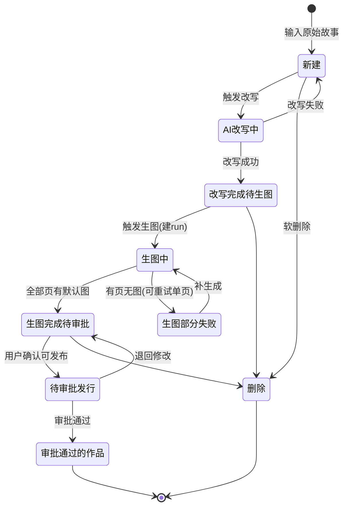

# 数据库设计

> 数据库：**SQLite（MVP）**。图片二进制落本地磁盘，DB 只存相对路径。
> 以下建表语句每个字段后均带中文注释，便于对照业务含义。

---

## 1. 建表语句

```sql
-- 故事/作品主表：一条用户输入的故事及其生命周期状态
CREATE TABLE stories (
  id                        INTEGER PRIMARY KEY,        -- 故事唯一ID
  user_title                TEXT,                       -- 用户自行输入的标题(可选,空则列表用预览占位)
  ai_title_zh               TEXT,                       -- 预留:AI生成的中文标题(MVP不实现生成,留空)
  ai_title_en               TEXT,                       -- 预留:AI生成的英文标题(MVP不实现生成,留空)
  original_text             TEXT,                       -- 用户原始输入的故事草稿
  refined_text              TEXT,                       -- AI改写后的故事正文(改写步骤产出)
  style                     TEXT,                       -- 全局画风/语气,注入改写/分页/锚图/每页prompt
  target_page_count         INTEGER,                    -- 目标页数(建故事时指定,改写/分页依据;重启后仍可恢复,故落库)
  status                    TEXT,                       -- 状态:新建/AI改写中/改写完成待生图/生图中/生图完成待审批/生图部分失败/待审批发行/审批通过的作品/删除
  safety_result             TEXT,                       -- JSON:文本安全校验{isSafe,reasons,sanitizedText},审计用
  rewrite_result            TEXT,                       -- JSON:改写评价{mode,feedback},即"对故事的评价"
  inspiration_image_path    TEXT,                       -- 可选灵感图本地路径(仅影响分页,不进一致性闭环)
  created_at                TEXT,                       -- 创建时间
  updated_at                TEXT,                       -- 更新时间
  deleted_at                TEXT                        -- 软删除时间,NULL表示未删
);

-- 角色定义 + 锚图:一致性闭环的"锚",归属到某一次生图run
CREATE TABLE characters (
  id                  INTEGER PRIMARY KEY,  -- 角色记录ID
  story_id            INTEGER,              -- 所属故事
  generation_run_id   INTEGER,              -- 所属生图run(换style重跑锚图会变,故挂run)
  char_key            TEXT,                 -- 角色稳定标识(slug,如 'little_bear')
  name                TEXT,                 -- 角色显示名(可能出现在故事里)
  visual_description  TEXT,                 -- 视觉描述(物种/颜色/衣服),用于拼CHARACTER LOCK
  sheet_image_path    TEXT                  -- 该角色锚图(干净全身参考图)的本地路径
);

-- 分页脚本:每一页的"故事"(你说的每一页的故事)
CREATE TABLE pages (
  id            INTEGER PRIMARY KEY,  -- 页记录ID
  story_id      INTEGER,              -- 所属故事
  page_number   INTEGER,              -- 页码,从1开始
  text_zh       TEXT,                 -- 该页中文旁白(给小朋友看,双语展示用)
  text_en       TEXT,                 -- 该页英文旁白(双语展示用;MVP 由 BookAgent 直接产出,中文留待后续)
  image_prompt  TEXT,                 -- 该页生图提示词(建议保持英文,喂给图像模型)
  lock_text     TEXT                  -- 缓存的CHARACTER LOCK(本页角色视觉描述拼接),重画时复用
);

-- 一次生图执行实例:用户点"生图"产生一条,配置快照自包含
CREATE TABLE generation_runs (
  id                  INTEGER PRIMARY KEY,  -- run唯一ID
  story_id            INTEGER,              -- 所属故事
  scope               TEXT,                 -- 作用域:full(整书)/single_page(单页补画);用于幂等续跑与列表区分 (R9)
  target_page_id      INTEGER,              -- scope=single_page 时指向目标页 (R9)
  status              TEXT,                 -- queued/running/completed/partial_failed/failed/interrupted
  progress            TEXT,                 -- JSON:{total,done,failed} 前端按需读
  last_error          TEXT,                 -- 最后一次异常信息(用于宕机/失败排查)
  frame_threshold     REAL,                 -- 单页验收分数线(默认0.75)
  max_frame_retry     INTEGER,              -- 单页手动重画(manual_new)时该页最多生成尝试次数(默认3);首跑由 initial_retry_budget 控制
  sequence_threshold  REAL,                 -- 整书一致性分数线(默认0.8)
  max_sequence_retry  INTEGER,              -- 整书修复最多轮(默认1,默认不自动修)
  initial_retry_budget INTEGER,             -- 首跑每页生成尝试次数上限(默认1)。首跑在该预算内按阈值循环:达标即停,落选图存为备用(kind=retry);预算用尽仍不达标则存最佳一版为默认。首跑之后如需更多候选,由用户手动 manual_new 扩展,系统不自动继续补画
  text_provider       TEXT,                 -- 文本模型provider(gemini/qwen/ark...)
  image_provider      TEXT,                 -- 图像模型provider
  vision_provider      TEXT,                 -- 视觉校验provider
  aspect_ratio        TEXT,                 -- 图片比例(如4:3)
  image_size          TEXT,                 -- 图片尺寸(如2K)
  started_at          TEXT,                 -- 开始时间
  finished_at         TEXT,                 -- 结束时间
  created_at          TEXT                  -- 创建时间
);

-- 页图像:默认图与备用图都在这里,同页多行靠 is_default 区分
CREATE TABLE page_images (
  id                  INTEGER PRIMARY KEY,  -- 图像记录ID
  page_id             INTEGER,              -- 所属页
  story_id            INTEGER,              -- 所属故事(冗余,方便查询)
  generation_run_id   INTEGER,              -- 所属生图run
  is_default          INTEGER,              -- 1=当前默认图,0=备用图
  kind                TEXT,                 -- initial/retry/manual_new/redraw(重画=多带一张参考图)
  prompt_used         TEXT,                 -- 实际喂给模型的终版prompt(含FIX/SAFETY修正,非原始image_prompt)
  reference_sheet_ids TEXT,                 -- JSON:本页用了哪些角色锚图(char_key列表),重画/复现必需
  image_path          TEXT,                 -- 图片本地路径
  identity_score      REAL,                 -- 身份一致性分(对锚图,0~1)
  identity_issues     TEXT,                 -- JSON:身份问题列表
  frame_score         REAL,                 -- 图文匹配分(0~1)
  frame_issues        TEXT,                 -- JSON:图文问题列表
  combined_score      REAL,                 -- min(identity,frame),最终采用分
  safety_passed       INTEGER,              -- 1=图像安全校验通过
  reference_image_id  INTEGER,              -- redraw时指向被参考/微调的图(其余情况NULL)
  attempt_index       INTEGER,              -- 该页第几次尝试(1,2,3...)
  created_at          TEXT                  -- 创建时间
);

-- 整书维度一致性评估:默认只评不修,存结果给用户看
CREATE TABLE sequence_checks (
  id                INTEGER PRIMARY KEY,  -- 记录ID
  story_id          INTEGER,              -- 所属故事
  generation_run_id INTEGER,              -- 所属生图run
  is_consistent     INTEGER,              -- 1=跨页一致
  score             REAL,                 -- 整书一致性分(0~1)
  issues            TEXT,                 -- JSON:一致性问题列表
  problem_pages     TEXT                  -- JSON:需要修复的页码列表
);
```

---

## 2. 状态机（stories.status）



说明：`generation_runs.status` 另有自己的生命周期（queued/running/completed/partial_failed/failed/interrupted），两者独立——前者是「作品级状态」，后者是「某次生图执行的状态」。

---

## 3. 字段含义速查（易混点）

| 字段 | 说明 |
| --- | --- |
| `pages.text_zh` / `text_en` | 给小朋友看的旁白，**双语分开存**；`image_prompt` 保持英文不双语 |
| `pages.lock_text` | 本页角色视觉描述拼接（CHARACTER LOCK），与语言无关，重画复用 |
| `page_images.prompt_used` | 注意是**终版 prompt**（重试中被 FIX/SAFETY 指令追加过），不是原始 `image_prompt` |
| `page_images.kind` | `initial`=首跑、`retry`=自动重试落选、`manual_new`=用户手动新增、`redraw`=基于参考图微调（本期不实现，仅占位） |
| `page_images.is_default` | 同页多行中只有一个为 1；初始每页仅 1 行默认图，**备用区为空**符合"不浪费"初衷 |
| `characters.generation_run_id` | 锚图归属 run 而非 story：换 style 重跑，锚图会变 |
| `generation_runs.initial_retry_budget` | 首跑每页生成尝试次数上限，默认 1（按需哲学核心参数）；>1 时首跑在预算内按阈值扩张、落选图留作备用 |
| `generation_runs.config 快照` | frame/sequence 阈值、provider、比例等全部内联存本表，run 自包含 |

---

## 4. 设计要点回顾

1. **配置不单开表**：直接快照进 `generation_runs`（MVP 够用，配置复用以后再说）；
2. **锚图挂 run（锚图 run 概念）**：换 style 整书重跑，锚图随之更新；显示/复用某故事的锚图 = 取该故事最近一次「整书 run（scope=full）」的 `characters`。**单页 `manual_new` run（scope=single_page）不重新生成锚图**，直接复用该 story 最近整书 run 的 `characters`，否则会丢失一致性基准；
3. **默认/备用 = 同页多行**：`is_default` 区分；重画单页 = 插入新行并翻转 `is_default`；
4. **run 幂等（按 run 作用域）**：worker 处理 run 时先查「本 run 是否已有产物」——只跳过 `generation_run_id = 本run` 且 `is_default=1` 的页，**不能按全局页默认判断**，否则换 style 整书重跑会被误跳过；支持宕机续跑；
5. **图片落盘**：`image_path` 仅存相对路径，真实文件在 `assets/{story_id}/{page_id}/{image_id}.png`；
6. **资源路径约定**：页图 `assets/{story_id}/{page_id}/{image_id}.png`，锚图 `assets/{story_id}/anchors/{character_id}.png`（二者统一，避免接口示例里 `assets/1/run7/bear.png` 这类不一致写法）；
7. **状态迁移守卫**：所有写操作加 `canTransition(from,to)` 校验（如 `generate` 仅 `改写完成待生图` 可触发、`publish` 仅 `待审批发行` 可触发），防止前端绕过脏数据。
