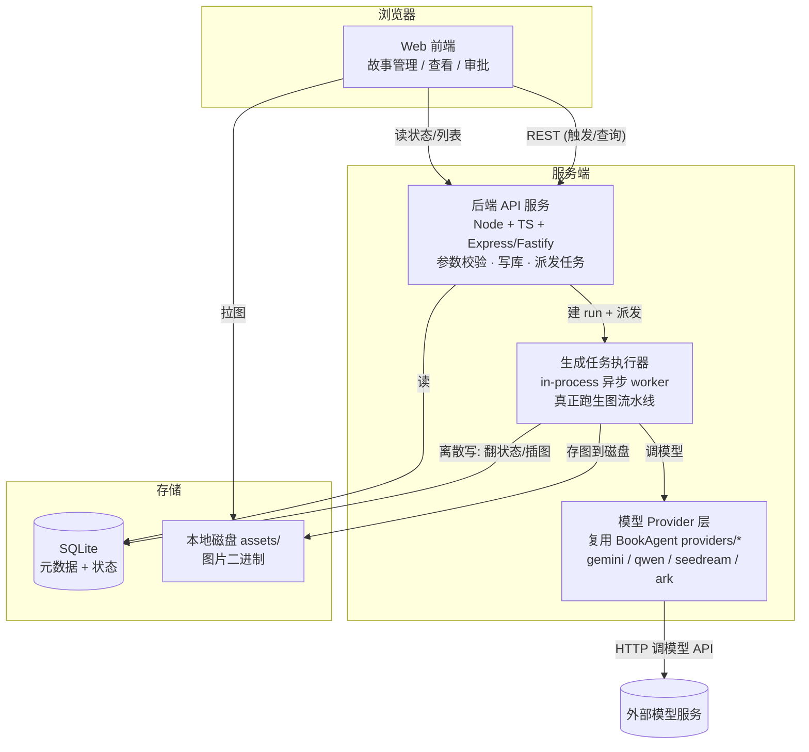
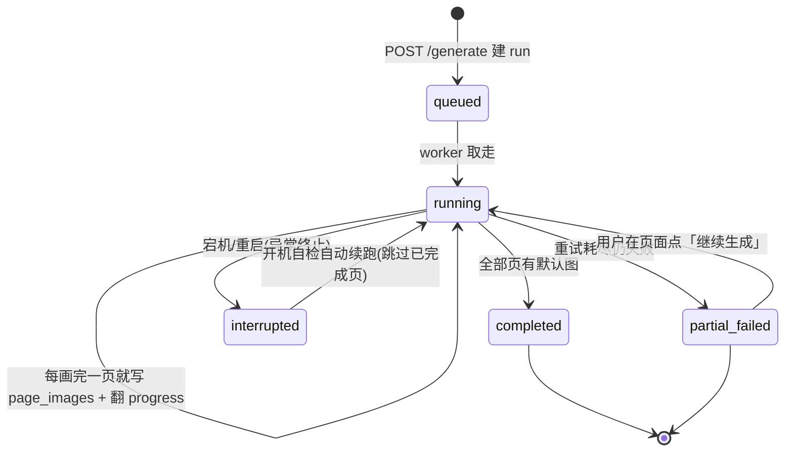
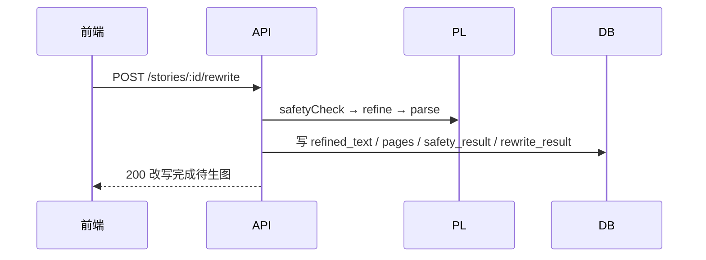
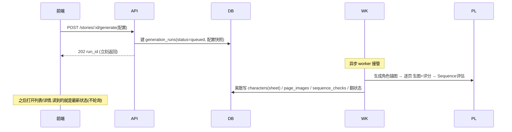
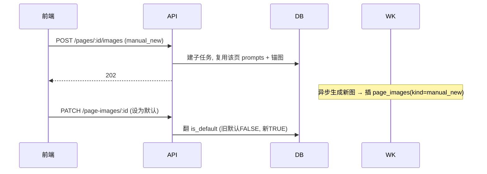

# 架构设计

> 范围：本次聚焦「生图链路」改造——把 BookAgent 纯前端的生图能力，改造成后端持久化、可灵活更新单页的绘本生成系统。
> 其余 5 大功能（TTS、交互阅读器、热区、双语资源状态、资产流水线）不在本文档范围内。

---

## 1. 设计目标

1. 故事与生成产物**持久化**到数据库 + 本地磁盘，不再停留在浏览器内存。
2. 生图**按需**：首跑每页只生成 1 张，质量不达标才自动/手动重生成，避免一次性浪费大量图片。
3. 可**灵活更新单页**：为某页新增图片、把某图设为默认、预留「基于参考图微调重画」。
4. 每页图分**默认图 / 备用图**，用户可手动切换。
5. 整书维度一致性**可评估**（默认只评不修），可审批发行。

---

## 2. 系统分层

**核心思想**：HTTP 请求进来**立刻返回**（建好 `generation_runs` 就走），重活（等模型 API、逐页生图）全在 `WK` 里异步跑；`WK` 只在「一页画完 / 状态变化」这种离散节点写库翻状态，**生成过程中不碰数据库、不持锁**。

---

## 3. 与 BookAgent 代码的映射 & 改造点

BookAgent 是浏览器 TS，我们要把它的「生图大脑」搬进 Node 后端，能复用的尽量复用，不能的直接改：

| BookAgent 现有代码 | 在后端怎么用 | 改造点（必须改的） |
| --- | --- | --- |
| `services/geminiService.ts` 的全部函数（`extractCharacters` / `refineStoryForPageCount` / `parseStoryIntoPages` / `generateImage` / 三个 Director / 两个 safety） | **直接搬**成后端 service 层（`storyService` / `generationService` / `directorService`） | 去掉浏览器依赖即可，函数签名基本不变 |
| `services/providers/*`（ModelBackend 接口 + gemini/qwen/seedream/ark 实现） | **整目录复用** | 逻辑通用，基本不动 |
| `vite.config.ts` 的 `define` 注入 `process.env.*` | 删掉，后端直接读真实 `process.env` | 不再需要 CORS 代理（**服务端调用模型 API 不受浏览器 CORS 限制**，比前端还简单） |
| `parseStoryIntoPages` 接收 `File \| null` 灵感图、`util.ts` 的 `fileToGenerativePart` 用 `FileReader` | 后端没有 `File`/`FileReader`，换成 `Buffer` | 写 Node 版的「读图→base64/dataUrl」工具函数 |
| `generateImage` 返回 **dataUrl（base64）** 给前端展示 | 后端要**落盘**：拿到 dataUrl → 解码写 `assets/{story}/{page}/{img}.png` → 只把路径存 `page_images.image_path` | 这是生图链路最大的改造点：从「内存 base64」变「磁盘文件 + 路径」 |
| `dataUrlToInlineImagePart` 等图像 parts 组装 | 后端仍可传 dataUrl 给模型 | 小改即可 |

**结论**：BookAgent 的「一致性闭环算法」（角色锚图 + CHARACTER LOCK + 三重 Director 打分）几乎原样保留，我们只是把它从「浏览器里跑」挪到「后端 worker 里跑」，并把产物从「内存渲染」变成「落盘 + 入库」。

---

## 4. 异步任务模型与中断恢复

### 4.1 任务执行模型
- **MVP 用 in-process 异步 worker**：不引入 Redis/BullMQ。多个故事「并行」= Node 事件循环里多个 `async` 函数在等模型 API 的 I/O，天然并发，DB 只在各自写图瞬间短暂插入。
- 任务登记表 = `generation_runs` 表本身（状态 + progress 字段），不需要额外队列表。
- 之后若规模变大，再把这个 worker 换成独立进程 / 消息队列，**接口和表不用变**。

### 4.2 运行生命周期

### 4.3 中断恢复（宕机 / 重启）
设计原则：**run 可重入（幂等）**——同一个 run 重新跑时，已经画完的页直接跳过，只补没完成的。

- `generation_runs` 增加 `last_error TEXT` 记录最后一次异常，便于排查；
- **worker 处理一个 run 时分阶段、且每阶段先查「是否已有产物」**：
  1. 阶段一：本 run 的 `characters`（锚图）是否齐？不齐才生成；
  2. 阶段二：逐页检查是否已有 `is_default=1` 的 `page_images`，有就跳过，只补缺失页；
  3. 阶段三：跑 `sequence_checks`（默认只评不修）。
- **开机自检**：服务启动时扫 `status IN ('queued','running')` 的 run，自动重新入队续跑（方案 A：自动续跑为主）；
- **兜底**：若续跑仍失败 / 超过重试，置 `partial_failed`，前端对该 run 显示「上次中断」并给「继续生成」按钮（方案 B：手动继续兜底）。两种并存。

---

## 5. 关键数据流

### 5.1 改写流（秒级，可同步）

### 5.2 生图 run 流（异步，不阻塞）

### 5.3 单页重生 / 设默认 流

---

## 6. 技术选型

| 层 | 建议 | 理由 |
| --- | --- | --- |
| 语言 | **TypeScript** | 直接复用 BookAgent 的 TS 代码，零翻译成本 |
| 后端框架 | **Express 或 Fastify** | 轻量，够用 |
| SQLite 驱动 | **better-sqlite3**（简单）或 **Drizzle ORM**（带类型+迁移） | MVP 前者即可；想要类型安全和迁移管理选后者 |
| 静态图 | Express `static('/assets')` | 按 `image_path` 吐文件 |
| 前端 | React（沿用 BookAgent 组件风格） | 本次聚焦生图，前端只做「管理+查看+审批」壳 |

---

## 7. 设计原则（硬约束）

1. 数据库**只在离散节点写**，生成中不持事务/不持锁；
2. 图片**落盘**，DB 只存相对路径；
3. 生图**配置快照进 `generation_runs`**，每次 run 自包含；
4. **锚图 `characters` 挂到 `generation_run_id`**（换 style 重跑锚图会变）；
5. 默认/备用图 = 同页在 `page_images` 多行，靠 `is_default` 区分；
6. **run 幂等可重入**，支持宕机后续跑。
